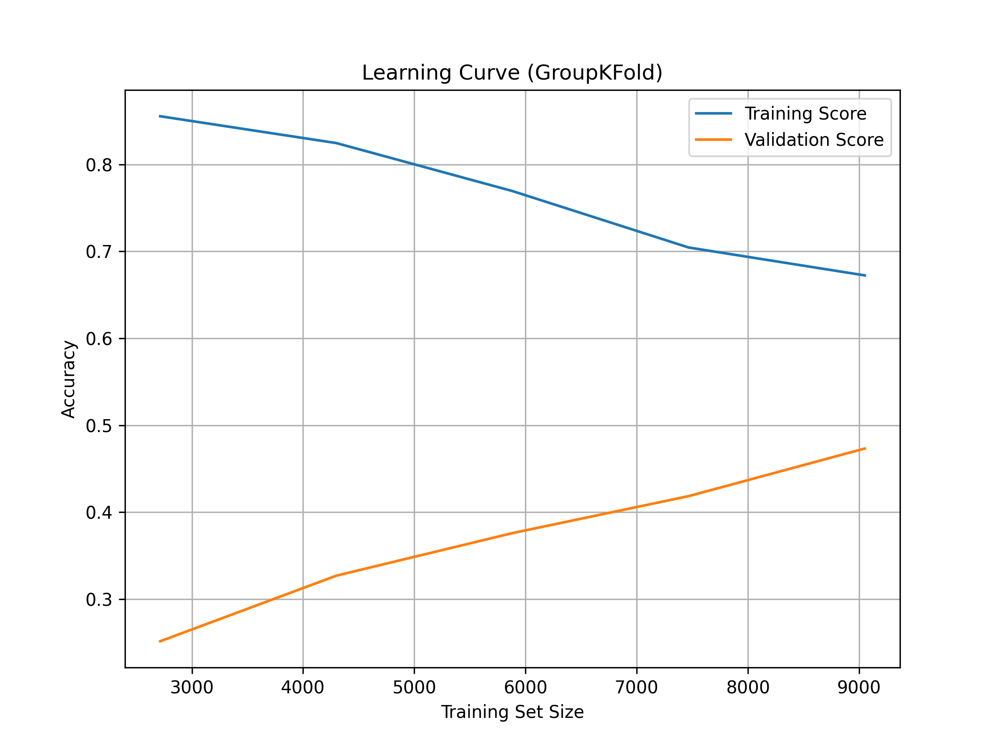
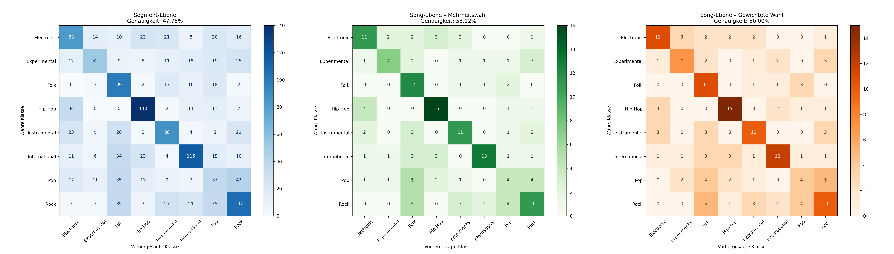
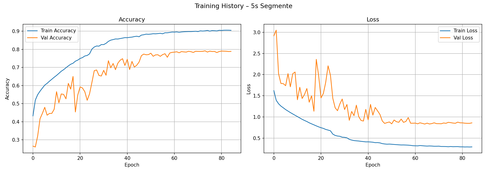
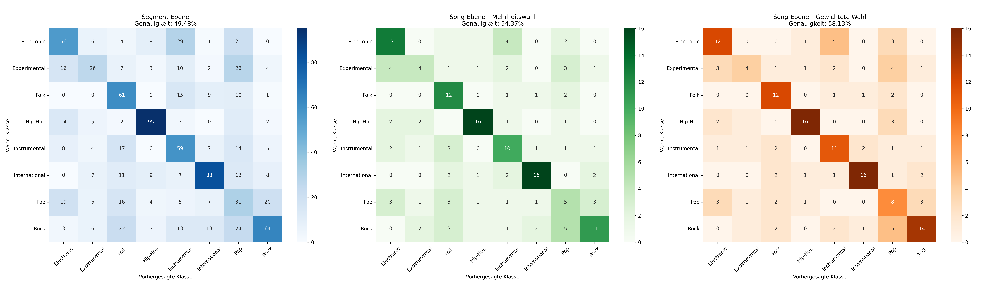

# Music Genre Classifier
Es wurde ein Modell entwickelt und trainiert, das Musikstücke automatisiert den Genres Electronic, Experimental, Folk, Hip-Hop, Instrumental, International, Pop und Rock zuordnet. 

Im Rahmen der Arbeit wurden zwei unterschiedliche Ansätze umgesetzt:
1. Eine Klassifikation auf Basis explizit definierter Merkmale, bei der vorab ausgewählte Eigenschaften der Musikstücke zur automatischen Einordnung herangezogen werden, sowie
2. eine Klassifikation mittels eines Convolutional Neural Networks (CNN), bei der das Modell relevante Merkmale eigenständig während des Trainingsprozesses identifiziert und nutzt.
## Dataset
Es wurde der Datensatz Free Music Archive (FMA) (https://github.com/mdeff/fma?tab=readme-ov-file)  verwendet. Konkret wurde der „fma_small“ Datensatz mit 8 balancierten
Musikklassen (reduziert auf 200 Tracks pro Klasse) betrachtet. 

## Ergebnisse Ansatz 1.
Die besten Ergebnisse wurden erzielt, indem die Songs in 3-Sekunden-Segmente unterteilt wurden.
Die Feature-Auswahl basiert auf vorherigen Experimenten. Dabei wurden die aussagekräftigsten Merkmale mithilfe eines scikit-learn Random Forest-Modells bestimmt und anschließend für das finale Modell verwendet.
Modell: SVC (Support Vector Classifier)
Kernel: rbf
Hyperparameter-Optimierung: GridSearchCV
Cross-Validation: GroupKFold (gruppiert nach track_id, um Data Leakage zu vermeiden)
Feature-Skalierung: StandardScaler
### Lern Kurve

### Confusion Matrizen

## Ergebnisse Ansatz 2.
Die besten Ergebnisse dieses Ansatzes wurden mit einem 2D-Convolutional Neural Network mit progressiver Filtererhöhung, BatchNorm, Dropout und L2-Regularisierung zur Genreklassifikation auf Basis von 3-Sekunden-Mel-Spektrogrammen gewonnen.
### Lernkurve

### Confusion Matrizen

## Limitationen
Die Modelle wurden auf einem vergleichsweise kleinen Testdatensatz evaluiert. Dadurch ist die statistische Aussagekraft der Testergebnisse eingeschränkt. Bei kleinen Testmengen können einzelne Fehlklassifikationen die Gesamtgenauigkeit überproportional beeinflussen, wodurch die Ergebnisse stärker zufallsabhängig sind.
Ein größerer und repräsentativerer Testdatensatz würde die Robustheit und Verlässlichkeit der Evaluation erhöhen und eine stabilere Einschätzung der tatsächlichen Modellleistung ermöglichen.
Auffällig ist, dass die Modelle insbesondere bei den Genres „Experimental“ und „Pop“ Schwierigkeiten in der Klassifikation zeigen. Eine mögliche Ursache für dieses Verhalten könnte an der unscharfen Genredefinition liegen die "pop" und "Experimental" mit sich bringen. 

